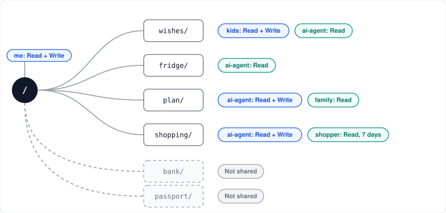

# S2



Self-hosted file storage with folder permissions for people, apps, and AI agents.

Give each one only the folders it needs: Read or Read + Write per path, with an expiry date. Use it from the web UI, REST, WebDAV, and MCP. Files are stored as plaintext at rest.

[Website](https://hrs23.github.io/s2/) | [Docs](docs/README.md) | [Contributing](CONTRIBUTING.md) | [MIT License](LICENSE)

## Getting started

Two containers (app, Postgres) from `ghcr.io/hrs23/s2`. The app listens on `127.0.0.1:${S2_PORT:-3000}`; put a TLS proxy in front.

```sh
mkdir s2 && cd s2
curl -fsSLO https://raw.githubusercontent.com/hrs23/s2/main/compose.yaml
printf 'AUTH_SECRET=%s\nPOSTGRES_PASSWORD=%s\nAPP_URL=http://localhost:3000\n' \
  "$(openssl rand -hex 32)" "$(openssl rand -hex 32)" > .env
```

Set `APP_URL` to the public URL. Keep `AUTH_SECRET` and `POSTGRES_PASSWORD` unchanged afterwards; other options are in [.env.example](.env.example).

```sh
docker compose up -d
curl --fail http://127.0.0.1:3000/health
docker compose exec app pnpm user create --email owner@example.com
```

### Update

```sh
docker compose pull && docker compose up -d
```

Set `S2_VERSION` in `.env` to pin a release (default `latest`). Migrations run on startup.

### Reset password

```sh
docker compose exec app pnpm user set-password --email owner@example.com
```

### Backup

Stop the stack and copy `.env` and `./data` (`POSTGRES_DATA_PATH` and `S2_STORAGE_PATH`) together; the database cannot be opened without the original `POSTGRES_PASSWORD`. Do this before an upgrade that notes a breaking change.

### Flags

| Variable | Default | Effect |
|---|---|---|
| `SIGNUP_ENABLED` | `false` | Self-service sign-up |
| `PASSKEY_ENABLED` | `true` | Passkeys |
| `TOTP_ENABLED` | `true` | TOTP and recovery codes |
| `EMAIL_ENABLED` | `false` | Email verification and password reset; needs `SMTP_HOST`, `SMTP_FROM` (optional `SMTP_PORT`, `SMTP_SECURE`, `SMTP_USER`, `SMTP_PASSWORD`) |

### Maintenance

Runs daily in the app (`MAINTENANCE_ENABLED=true`, `MAINTENANCE_CRON="0 17 * * *"`, UTC). One-shot:

```sh
docker compose exec app pnpm maintenance
```
