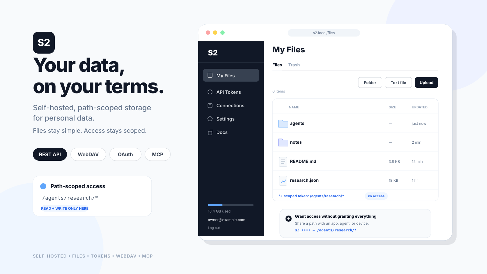

# S2

Self-hosted, path-scoped storage for personal data, exposed via web UI, REST, WebDAV, OAuth, and MCP.
Files are stored as plaintext at rest. There is no S3-compatible API.

Self-host with Docker Compose: [selfhost/README.md](selfhost/README.md).

[Docs](docs/README.md) | [Contributing](CONTRIBUTING.md) | [MIT License](LICENSE)
