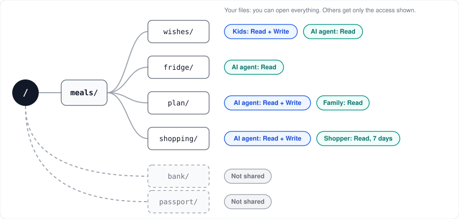
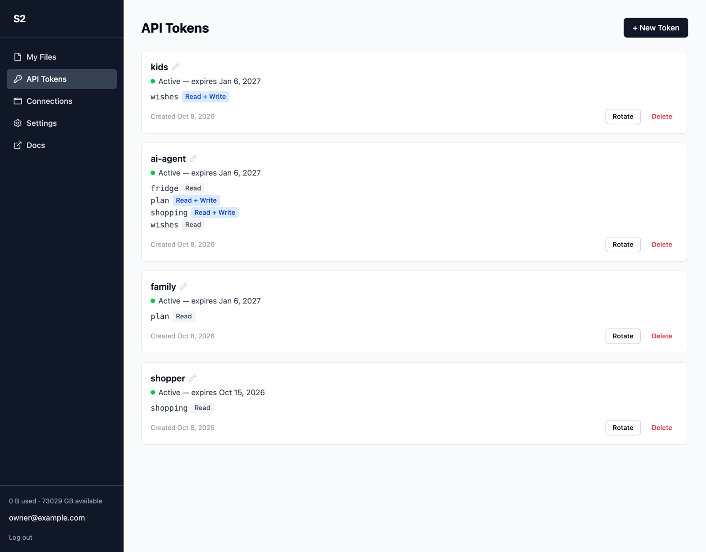

# S2


Self-hosted file storage with folder permissions for people, apps, and AI agents.

**Weekly dinners, with your own AI agent.** Kids add food wishes to `wishes/`, and you add fridge notes to `fridge/`. The agent can read both, and read and write `plan/` and `shopping/`. The family reads the plan, and the shopper reads the list for seven days. The agent cannot open `bank/` or `passport/`.



More ways to use it:

- **Monthly budget**: drop receipts in `receipts/`, let an AI agent write `summary/`, and share only the summary with your partner.
- **Kids' albums**: the family adds photos, an AI agent builds albums, and grandparents read only the albums.
- **Backups**: give a backup script Read + Write on one folder and nothing else.

How it works:

- **API tokens**: choose a starting folder, Read or Read + Write for each path, and an expiry date. Other files stay hidden.
- **MCP**: connect ChatGPT, Claude, or another MCP client through OAuth. Approve its folders and permissions in your browser.
- **REST and WebDAV**: use an API token with scripts, Finder, or Windows Explorer.
- **Self-hosted**: Docker Compose, PostgreSQL for metadata, files on storage you control.



API tokens for REST and WebDAV. MCP connections use browser approval.

Files are stored as plaintext at rest, and there is no S3-compatible API.

[Docs](docs/README.md) | [Contributing](CONTRIBUTING.md) | [MIT License](LICENSE)

## Getting started

Two containers (app, Postgres) from `ghcr.io/hrs23/s2`. The app listens on `127.0.0.1:${S2_PORT:-3000}`; put a TLS proxy in front.

```sh
mkdir s2 && cd s2
curl -fsSLO https://raw.githubusercontent.com/hrs23/s2/main/compose.yaml
printf 'AUTH_SECRET=%s\nPOSTGRES_PASSWORD=%s\nAPP_URL=http://localhost:3000\n' \
  "$(openssl rand -hex 32)" "$(openssl rand -hex 32)" > .env
```

Set `APP_URL` to the public URL. Keep `AUTH_SECRET` and `POSTGRES_PASSWORD` unchanged afterwards; other options are in [.env.example](.env.example).

```sh
docker compose up -d
curl --fail http://127.0.0.1:3000/health
docker compose exec app pnpm user create --email owner@example.com
```

### Update

```sh
docker compose pull && docker compose up -d
```

Set `S2_VERSION` in `.env` to pin a release (default `latest`). Migrations run on startup.

### Reset password

```sh
docker compose exec app pnpm user set-password --email owner@example.com
```

### Backup

Stop the stack and copy `.env` and `./data` (`POSTGRES_DATA_PATH` and `S2_STORAGE_PATH`) together; the database cannot be opened without the original `POSTGRES_PASSWORD`. Do this before an upgrade that notes a breaking change.

### Flags

| Variable | Default | Effect |
|---|---|---|
| `SIGNUP_ENABLED` | `false` | Self-service sign-up |
| `PASSKEY_ENABLED` | `true` | Passkeys |
| `TOTP_ENABLED` | `true` | TOTP and recovery codes |
| `EMAIL_ENABLED` | `false` | Email verification and password reset; needs `SMTP_HOST`, `SMTP_FROM` (optional `SMTP_PORT`, `SMTP_SECURE`, `SMTP_USER`, `SMTP_PASSWORD`) |

### Maintenance

Runs daily in the app (`MAINTENANCE_ENABLED=true`, `MAINTENANCE_CRON="0 17 * * *"`, UTC). One-shot:

```sh
docker compose exec app pnpm maintenance
```
